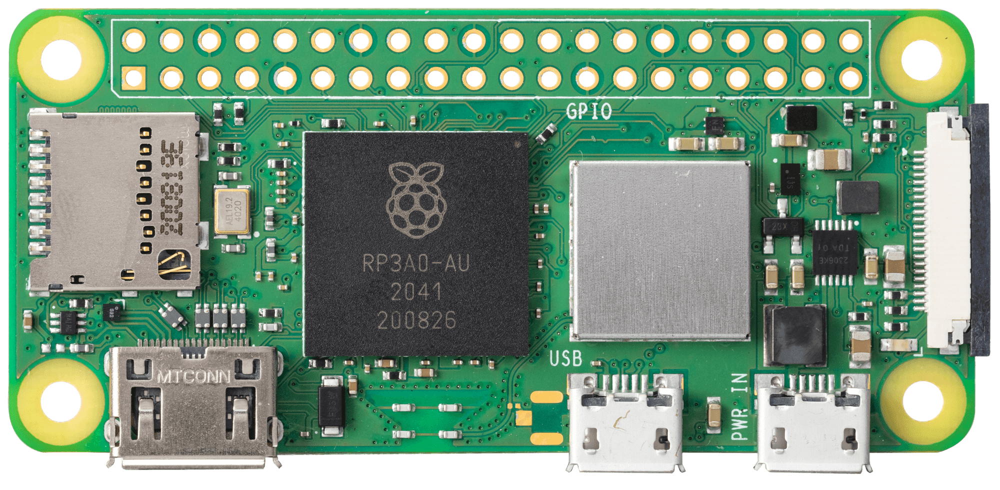
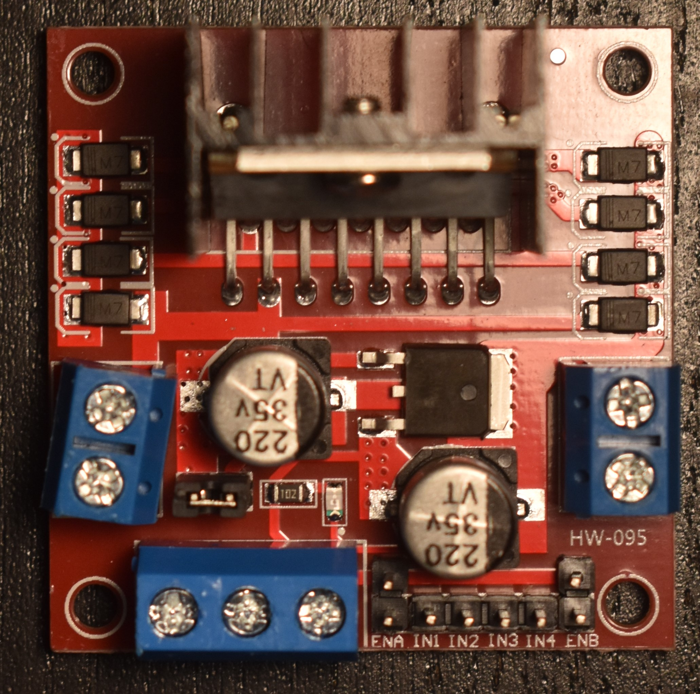
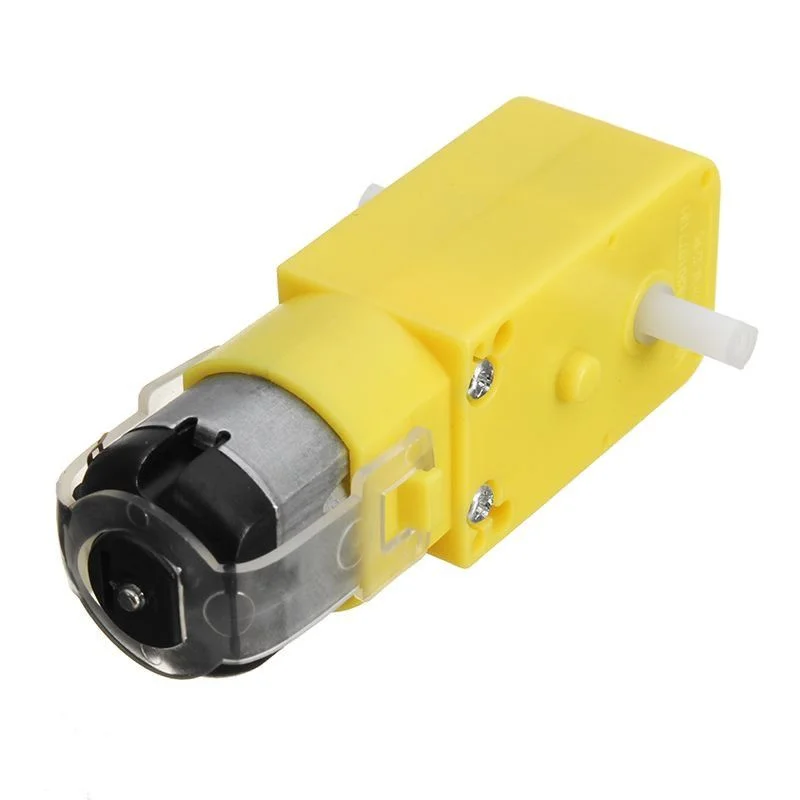

# Introduction

This repository contains a guide to creating a "remote-controlled" car/buggy using a Raspberry Pi Zero 2 W, along with the Python scripts used to operate the car over SSH. 

# Components

- Raspberry Pi - Zero 2 W, along with a microSD card to flash the OS onto, along with **GPIO headers** soldered on to it.

- A power bank capable of providing 5V DC 2.5A power output.

- L298N DC Motor Controller Module.

- Four (4) 3-6V DC Motors (with soldered wires).

- A rechargabale 12V 5200mAh battery/power supply.

- Male to Male/ Male to Female/ Female to Female Dupont Wires.

- RC Car board to wire the motors/components to. 

Remember, you will probably need to do some soldering, so consider getting a decent soldering tool kit.

# Wiring your RC car

Before you start wiring, make sure you're familiar with the GPIO pinout configuration of your Raspberry Pi.

The following are the connections you will need to make between your different components. 

# GPIO Pin definitions

The following are the GPIO pin definitions for the L298N motor driver.

**Motor Set 1**

IN1 = 22

IN2 = 27

EN-A = 17

**Motor Set 2**

IN3 = 13

IN4 = 19

EN-B = 26

