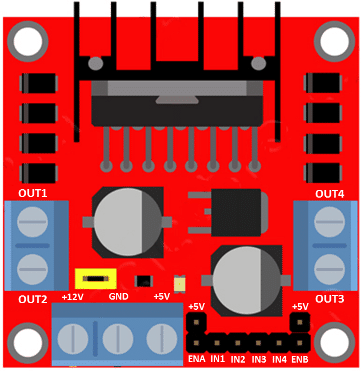

# Introduction

This repository contains a guide to creating a "remote-controlled" car/buggy using a Raspberry Pi Zero 2 W, along with the Python scripts used to operate the car over SSH. 

# Components

- Raspberry Pi - Zero 2 W, along with a microSD card to flash the OS onto, along with **GPIO headers** soldered on to it.

- A power bank capable of providing 5V DC 2.5A power output.

- L298N DC Motor Controller Module.

- Four (4) 3-6V DC Motors (with soldered wires).

- A rechargabale 12V 5200mAh battery/power supply.

- Male to Male/ Male to Female/ Female to Female Dupont Wires.

- RC Car board to wire the motors/components to. 

Remember, you will probably need to do some soldering, so consider getting a decent soldering tool kit.

# Wiring your RC car

Before you start wiring, make sure you're familiar with the GPIO pinout configuration of your Raspberry Pi.

Also be familiar with the components of the L289N motor driver module. 

The following are the connections you will need to make between your different components. 

## Connection Definitions

**Motor Set 1**

These connections will let you control the motors connected to OUT1 and OUT2.

IN1 to GPIO 22

IN2 to GPIO 27

EN-A to GPIO 17

**Motor Set 2**

These connections will let you control the motors connected to OUT3 and OUT4.

IN3 to GPIO 13

IN4 to GPIO 19

EN-B to GPIO 26

**Power Supply**

These connections will enable proper power supply.

L298N +5V to Pi 5V

L298N GND to Pi GND

12V battery Negative (-) Terminal to Pi GND

12V battery Positive (+) to L298N +12V

I used this YouTube video as a guide: https://www.youtube.com/watch?v=m8r8prXrcgw&t=115s
